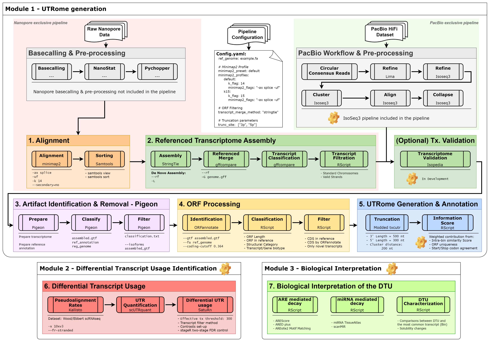
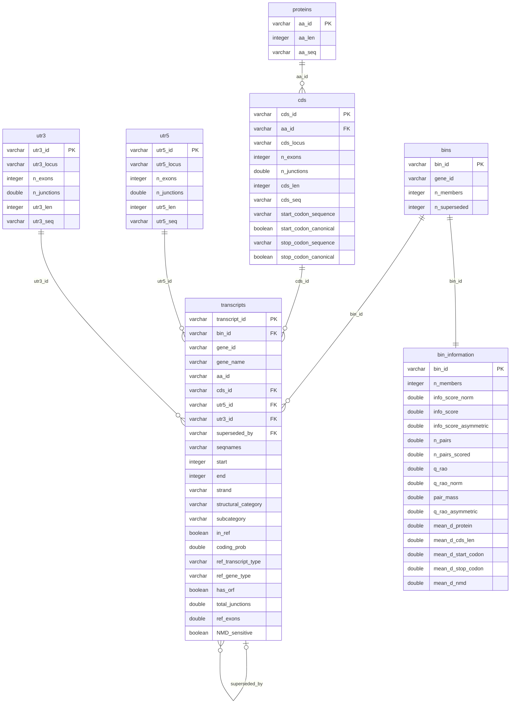

# ENDome generation

[](https://snakemake.github.io)
[](https://pixi.sh)
[](LICENSE)

This repository contains a Snakemake pipeline to generate 3′ or 5′ end-tagged transcriptomes, which we call **ENDomes**, from long-read RNA-seq data. The ENDomes are then employed to quantify transcript-end (UTR) usage in end-tagged single-cell and single-nucleus RNA-seq data (e.g. 10x Genomics 3′ or 5′), and to test for differential UTR usage between conditions or cell types.

The pipeline is a generalization of the approach used to build a brain-specific 3′ UTRome from Oxford Nanopore long-read data, which was then used to detect differential 3′ UTR usage (e.g. in *APP* and *SNCA*) in:

> Fairbrother-Browne Á., Grant-Peters M., Brenton J.W. *et al.* Molecular and cellular signatures differentiate Parkinson's disease from Parkinson's disease with dementia. *bioRxiv* 2025.03.04.641379 (2025). https://doi.org/10.1101/2025.03.04.641379

Both the truncation strategy and the UTR quantification are based on the work of Mervin M. Fansler, who developed [txcutr](https://github.com/mfansler/txcutr) and [scUTRquant](https://github.com/Mayrlab/scUTRquant). `txcutr` is a Bioconductor package that truncates a transcriptome to the sequenced end of each transcript and merges the transcripts that become indistinguishable. `scUTRquant` is a pipeline that quantifies 3′ UTR isoforms from scRNA-seq data against this type of truncated transcriptome. Both are described in:

> Fansler M.M., Mitschka S. & Mayr C. Quantifying 3′UTR length from scRNA-seq data reveals changes independent of gene expression. *Nature Communications* 15:4050 (2024). https://doi.org/10.1038/s41467-024-48254-9

The main differences of our pipeline are that the truncated transcriptome is built from long-read data instead of from the reference annotation alone, and that transcripts can also be truncated at their 5′ end. For the latter, we employ [txendcutr](https://github.com/guillermo1996/txendcutr), a fork of txcutr that supports 5′-end truncation.

Please note that the pipeline is still in development.

# Overview

End-tagged scRNA-seq libraries (e.g. 10x Genomics 3′ or 5′) only sequence a few hundred bases at one end of each transcript. For this reason, tools such as [scUTRquant](https://github.com/Mayrlab/scUTRquant) quantify the reads against a *truncated* transcriptome, where every transcript is cut down to a fixed window at the sequenced end. Transcripts whose windows cannot be distinguished are merged into a single quantification unit, which we call a **bin**.

The pipeline is divided in two modules:

- **Module 1 - ENDome generation (steps 01 to 05)**: builds the truncated transcriptome from long-read RNA-seq data.
- **Module 2 - Differential UTR usage (step 06, in development)**: quantifies the bins of each ENDome in single-cell or single-nucleus data, and tests for differential usage between conditions within each cell type.



*Note that Module 3 (biological interpretation of the differential usage events) is only shown for context, and it is not part of this pipeline.*

## Module 1: ENDome generation

The long reads can come from Oxford Nanopore or PacBio HiFi. For Nanopore data, basecalling and read pre-processing are done outside the pipeline, so the starting point are the FASTQ files (or already aligned BAM files). A PacBio HiFi entry point based on the IsoSeq3 workflow is currently in development.

1. **Alignment**: the long reads are aligned to the genome with minimap2 and sorted with samtools.
2. **Referenced transcriptome assembly**: first, each sample is assembled with StringTie. Then, all samples are merged into a single transcriptome per dataset and sample group, guided by the reference annotation. The merged transcripts are classified against the reference with gffcompare, and only those in standard chromosomes and with a valid strand are kept. A validation step against Isopedia is currently in development.
3. **Artifact removal**: we employ pigeon to classify each transcript against the reference and to remove likely artifacts, such as intra-priming, RT switching or non-canonical junctions with low coverage.
4. **ORF processing**: ORFannotate predicts the coding ORFs, protein sequences, UTRs and NMD sensitivity of each transcript. The transcripts are then categorized and filtered by coding status and reference biotype (see [ORF filter](#orf-filter)).
5. **Truncation and annotation**: each transcript is truncated with txendcutr to a window of `w` nt at its 5′ or 3′ end, and the transcripts whose ends fall close together are merged into bins. For each ENDome, the pipeline also generates:
    - A DuckDB database with the transcript, ORF, UTR and bin tables.
    - The **Bin Information Content** score of every bin, which measures how much ORF/protein information is lost when its members are collapsed.
    - An HTML characterization report.

## Module 2: differential UTR usage (in development)

6. **Differential transcript usage**: the single-cell or single-nucleus reads are pseudoaligned to each ENDome with kallisto/bustools, and scUTRquant generates the bin counts. Nuclei with low transcript diversity (less than 300 effective transcripts) are removed. Then, we test the differential usage of each bin between conditions within each cell type with satuRn, using stageR for the two-stage FDR control.

## Inputs

| Input | Config key | Notes |
|---|---|---|
| Reference genome (FASTA) | `ref_genome` | GRCh38 primary assembly. A `.fai` index is created next to it if missing. |
| Reference annotation (GTF) | `ref_annotation` | GENCODE v48. Must carry the `gene_type` and `transcript_type` attributes used by the ORF filters. |
| Long-read samples | `input_dir_<dataset>`, `<group>_samples_<dataset>` | See [Datasets and groups](#datasets-and-groups). |
| Single-cell samples (Module 2) | `scutrquant_sample_file` | Sample sheet of 10x FASTQ or BAM files, with the condition and cell-type labels used in the differential usage tests. |

> [!NOTE]
> `pigeon prepare` writes the sorted reference annotation **in the same folder** as `ref_annotation`, so that folder must be writable.

## Outputs

**Module 1**: for every ENDome (dataset × group × ORF filter × window width × transcript end), the pipeline generates:

- The ENDome: the truncated GTF and FASTA files, the merge table (transcript → bin) and the post-truncation overlap table.
- A DuckDB database with the ENDome tables and the information score of each bin.
- A characterization report.
- A kallisto index of the truncated sequences.

**Module 2** *(in development)*: for every ENDome and single-cell dataset, the pipeline generates:

- Bin-level and gene-level count matrices (`SingleCellExperiment`), together with a UMI QC report per sample.
- **Differential UTR usage results**: for each contrast and cell type, a table with one row per bin with its usage estimate, p-value and stageR-adjusted FDR, both at the bin and at the gene level.

More details can be found in [Output layout](#output-layout) and [The ENDome database](#the-endome-database).

# Installation

## Requirements

- [pixi](https://pixi.sh), which provides Snakemake (`>=9.23.0,<10`) and conda (`>=26.5.3,<27`).

## Steps

1. Install pixi (if it is not already installed):
    ```bash
    curl -fsSL https://pixi.sh/install.sh | sh
    ```
2. Clone the repository and install the Snakemake environment:
    ```bash
    git clone git@github.com:guillermo1996/Endome_generation.git
    cd Endome_generation
    pixi install
    ```
3. (Optional) Create all the tool environments before the first run:
    ```bash
    pixi run snakemake --profile workflow/profiles/default --conda-create-envs-only
    ```

## Software environments

Each tool runs in its own conda environment, defined in [`workflow/envs/`](workflow/envs). Snakemake creates them under `.snakemake/conda/` the first time they are needed. Some components are downloaded at runtime instead:

| Component | How it is provided |
|---|---|
| ORFannotate | The release is downloaded into `tools/ORFannotate-<version>/`. The conda environment is taken from the `ORFannotate.conda_env.yml` file of that release. |
| R environment ([`r.yaml`](workflow/envs/r.yaml)) | Once the conda environment is created, [`r.post-deploy.sh`](workflow/envs/r.post-deploy.sh) installs `txendcutr` and other packages from GitHub. |
| scUTRquant (step 06) | The release is downloaded into `tools/`. |

| Tool | Version | Step |
|---|---|---|
| [minimap2](https://github.com/lh3/minimap2) | 2.28 | 01 |
| [samtools](https://www.htslib.org) | 1.21 | 01 |
| [StringTie](https://github.com/gpertea/stringtie) | 3.0.0 | 02 |
| [gffcompare](https://github.com/gpertea/gffcompare) | 0.12.6 | 02 |
| [pigeon](https://isoseq.how/classification/pigeon.html) (pbpigeon) | 1.4.0 | 03 |
| [ORFannotate](https://github.com/egustavsson/ORFannotate) (CPAT 3.0.5) | v1.0.0 | 04 |
| R / Bioconductor | 4.5.3 / 3.22 | 02–05 |
| [txendcutr](https://github.com/guillermo1996/txendcutr) | 1.0.1 | 05 |
| [MMseqs2](https://github.com/soedinglab/MMseqs2) | 18.8cc5c | 05 |
| [DuckDB](https://duckdb.org) (R package) | 1.5.4.2 | 05 |
| kallisto / bustools (scUTRquant build) | 0.46.2sq / 0.40.0 | 05–06 |
| [scUTRquant](https://github.com/Mayrlab/scUTRquant) | v0.5.1 | 06 |

# Configuration

The pipeline is controlled by a single configuration file, [`config/config.yaml`](config/config.yaml). Any value can also be overridden from the command line, e.g. `--config trunc_width='[300]'`.

## Reference and output paths

| Key | Default | Description |
|---|---|---|
| `ref_genome` | `…/GRCh38.primary_assembly.genome.fa` | Reference genome FASTA. |
| `ref_annotation` | `…/gencode.v48.annotation.gtf` | Reference annotation GTF. |
| `main_output_path` | `debug_results` | Root of all outputs. |
| `log_path` / `benchmark_path` | `.logs` / `.benchmarks` | Log and benchmark sub-folders, created inside every step folder. |

## Datasets and groups

A dataset is a set of long-read samples divided into groups. All the samples of the selected group(s) are assembled together into a single transcriptome.

| Key | Description |
|---|---|
| `input_dataset` | Dataset(s) to process. |
| `input_group` | `control`, `case`, or `control_case` (both groups pooled). |

> [!NOTE]
> Dataset support will be improved in future versions. For now, adding a new dataset requires two code changes:
> - Add its name to the `dataset` wildcard constraint in [`workflow/Snakefile`](workflow/Snakefile).
> - Add a new branch to `generate_input_samples_df()` in [`workflow/rules/00-Common.smk`](workflow/rules/00-Common.smk) that maps the sample IDs to their FASTQ files.

Additionally, the pipeline can be started from any step, as long as the inputs of that step are in the expected folder and have the expected file names. For example, if we already have a custom transcriptome that has been built and verified, we can truncate it directly. To do so, we need to place its GTF file where step 04 would write the filtered transcriptome (`{main_output_path}/{dataset}.{group}/04-ORF_Identification-<hash>/ORF_Filtration/{prefix}.{orf_filter}.orf_filter.gtf`), and Snakemake will pick it up for truncation.

To find the exact paths, we can either:
- Execute a dry run (`pixi run snakemake -n --profile workflow/profiles/default`), which lists the files expected by each job, including the `<hash>` suffix of every step folder.
- Set `use_hash: False`, so that the step folders are only named after the step (see [Output folder hashing](#output-folder-hashing)).

Note that only the truncation (txendcutr) and the kallisto index require just the GTF file. The ENDome database, the Bin Information Content scores and the report also need some outputs from step 04: the ORFannotate protein and UTR FASTA files, and the isoform summary table. These files also need to be placed in their step 04 folders, or the pipeline needs to start from an earlier step.

## Tool settings: the preset system

Every tool is configured with two keys:

- `<tool>_settings`: a block of named presets, each one with a set of parameter values.
- `<tool>_preset`: the name of the preset to employ.

To change the behaviour of a tool, we only need to change its `<tool>_preset` key, or add a new preset to `<tool>_settings`. For example, for minimap2:

```yaml
minimap2_preset: default     # Options: default | k15

minimap2_settings:
  default:
    minimap2_kmer:  14
    minimap2_flags: "-ax splice -uf --MD --secondary=no"
  k15:
    minimap2_kmer:  15
    minimap2_flags: "-ax splice -uf --MD --secondary=no"
```

The following table shows the default preset of each tool:

| Step | Preset key (default) | Default values |
|---|---|---|
| 01 | `minimap2_preset: default` | `-ax splice -uf --MD --secondary=no`, `-k 14` |
| 02 | `stringtie_preset: unguided_guided` | per-sample assembly without a reference (`-L --rf`); merge guided by `ref_annotation` (`--merge -L -G`) |
| 02 | `gffcompare_preset: default` | `-T` (alternative `strict`: `--strict-match -e 50 -d 50 -T`) |
| 03 | `pigeon_preset: default` | pigeon defaults |
| 04 | `orfannotate_preset: default` | ORFannotate `v1.0.0`, human CPAT model |
| 04 | `orf_filter_preset: pc` | See [ORF filter](#orf-filter). |
| 05 | `txendcutr_preset: default` | `merge_distance: 200`, `genome: hg38` |
| 05 | `mmseqs2_preset: default` | `-s 7.5 -e 10000 --max-seqs 5000 --max-accept 100000 --max-rejected 100000 --alignment-mode 3 -c 0 --cov-mode 0` |
| 05 | `scoring_settings.default` | `protein_metric: bsr_max`, `length_scaling: ratio`, `member_weights: uniform`; weights protein 1.0, cds_len 0.1, start_codon 0.2, stop_codon 0.2, nmd 0.4 |
| 06 | `scUTRquant_preset: default` | scUTRquant `v0.5.1`, `genome: hg38`; run settings from `scUTRquant_config_template` |

## Main ENDome parameters

Four settings define what an ENDome is, and each of them is part of its name (`{dataset}.{group}.{merge_method}.{orf_filter}.w{width}.{txEnd}`):
- The merge method: how the transcriptome is assembled.
- The ORF filter: which transcripts are kept.
- The truncation width: how much of each transcript end is kept.
- The truncation site: which end is kept.

Together with the dataset and the sample group, these are the main parameters of a run.

| Key | Default | Values | Description |
|---|---|---|---|
| `transcript_merge_method` | `["stringtie"]` | `stringtie` | How the per-sample assemblies are merged into one transcriptome (step 02). |
| `orf_filter_preset` | `pc` | `all`, `orfann_coding`, `pc`, or a custom preset | Which transcripts enter the ENDome (step 04). See [ORF filter](#orf-filter). |
| `trunc_width` | `[500, 300]` | integers (nt) | Width of the window kept at the transcript end (step 05). |
| `trunc_site` | `["3p", "5p"]` | `3p`, `5p` | Transcript end that is kept: `3p` for 3′ end-tagged libraries (e.g. 10x 3′), `5p` for 5′ end-tagged libraries (e.g. 10x 5′). |
| `input_dataset` | — | dataset names | Long-read dataset(s) to assemble. See [Datasets and groups](#datasets-and-groups). |
| `input_group` | `["control"]` | `control`, `case`, `control_case` | Sample group(s) assembled together. |

The pipeline builds one ENDome for every combination of these values. A typical run employs one dataset and one group, with several widths and both ends. For example, the default values above generate four ENDomes (`w500.3p`, `w500.5p`, `w300.3p`, `w300.5p`) from a single assembly.

### ORF filter

The ORF filter decides which transcripts from the assembled transcriptome are truncated. Broadly, we can build two types of ENDome:
- **Conservative**: only protein-coding transcripts anchored to the reference annotation are kept. This is the approach followed for the brain UTRome in Fairbrother-Browne *et al.*, where only transcripts classified as coding and annotated as `protein_coding` in GENCODE were kept.
- **Inclusive**: novel and non-coding transcripts are also kept. They add more diversity of transcript ends, but their models are less reliable.

The filter also affects the [Bin Information Content](#the-endome-database) scores, which compare the ORF and protein features of the members of a bin. Note that transcripts without an ORF can only be scored on part of these features.

The following table describes the available presets:

| Preset | Reference gene type | Reference transcript type | ORFannotate class | Transcript in reference | Keeps |
|---|---|---|---|---|---|
| `all` | any | any | any | not required | Every transcript that passed artifact removal, including novel and non-coding ones. |
| `orfann_coding` | any | any | `coding` | not required | Every transcript predicted to be coding, including novel ones. |
| `pc` (default) | `protein_coding` | `protein_coding` | `coding` | required | Coding transcripts matched to a GENCODE protein-coding transcript. |

To define a custom filter, we only need to add a new preset to `orf_filter_settings` with the same four keys. A value of `["all"]` disables that criterion, and an empty `in_ref_filter` does not require the transcript to be in the reference.

## Output folder hashing

| Key | Default | Description |
|---|---|---|
| `use_hash` | `True` | Append a 5-character parameter hash to every step folder, e.g. `02-Transcriptome_Assembly-3b899`. |

The hash is an MD5 digest of the preset values of the step **and of every previous step**. This has some implications:
- Changing a setting creates new folders for that step and all the following ones. Previous results are kept, so different settings can be compared side by side.
- Changing a setting never overwrites old results, and it does not re-run the upstream steps whose settings did not change.
- Preset names are not included in the hash, so renaming a preset without changing its values keeps the same folders.

With `use_hash: False`, the folders are only named after the step (e.g. `02-Transcriptome_Assembly`). Note that, in this case, Snakemake may not detect parameter changes inside a step, so we recommend it only for fixed, final configurations.

## Testing and debugging

| Key | Default | Description |
|---|---|---|
| `use_toy_data` | `False` | Subsample every BAM before assembly for a quick end-to-end test. |
| `subsample_prop` / `subsample_seed` | `"0001"` / `1` | Fraction of reads kept (`samtools view -s {seed}.{prop}`; `"0001"` = 0.1%) and random seed. |
| `debug` | `False` | Print parse-time timing information to stderr. |

# Usage

All commands must be executed from the root of the repository. The [`default`](workflow/profiles/default/config.yaml) profile enables the conda environments and uses up to 64 cores. It is also configured to continue after a failed job and to re-run incomplete jobs.

```bash
# Dry run: list the jobs that would be executed
pixi run snakemake -n --profile workflow/profiles/default

# Run the pipeline
pixi run snakemake --profile workflow/profiles/default

# Limit the cores, and override settings for this run only
pixi run snakemake --profile workflow/profiles/default --cores 16 \
    --config input_dataset='["Ebbert"]' trunc_site='["5p"]' trunc_width='[300,500]'
```

A SLURM profile is also available in [`workflow/profiles/slurm`](workflow/profiles/slurm), but it has not been tested yet.

# Output layout

Each step writes its results into its own folder, and every rule generates a log and a benchmark file. In addition, the `parameters.yaml` file inside each step folder records the settings employed in that step and in all the previous ones.

```text
{main_output_path}/
└── {dataset}.{group}/                                   e.g. Wood.control/
    ├── 01-Alignment-<hash>/
    │   ├── Minimap2/{sample}.sam
    │   └── Samtools_sort/{sample}_sorted.bam
    ├── 02-Transcriptome_Assembly-<hash>/
    │   ├── StringTie_Sample_Assembly/{sample}.gtf
    │   ├── StringTie_Merge/{dataset}.{group}.merged.gtf
    │   ├── gffcompare/{dataset}.{group}.gffcompare.{annotated.gtf,stats,loci,tracking}
    │   └── transcriptome_assembly/{prefix}.annotated.clean.gtf
    ├── 03-Artifact_Removal-<hash>/
    │   ├── Prepare/{prefix}.pigeon.sorted.gtf
    │   └── Classify_Filter/
    │       ├── {prefix}.pigeon_classification.txt                             structural classification
    │       ├── {prefix}.pigeon.sorted.filtered.gtf                            filtered transcriptome
    │       ├── {prefix}.pigeon_classification.filtered_lite_classification.txt
    │       └── {prefix}.pigeon_classification.filtered_lite_reasons.txt       why each isoform was removed
    ├── 04-ORF_Identification-<hash>/
    │   ├── ORFannotate/{prefix}/                  ORFannotate_summary.tsv, ORFannotate_annotated.gtf,
    │   │                                          protein.fa, utr5.fa, utr3.fa, …
    │   ├── ORF_Category/{prefix}.orf_annotated.gtf, {prefix}.isoform_summary.tsv
    │   └── ORF_Filtration/{prefix}.{orf_filter}.orf_filter.gtf
    └── 05-Truncation-<hash>/
        ├── txendcutr/{prefix}.{orf_filter}.txendcutr.w{width}.{txEnd}.{gtf,fa.gz,merge.tsv,overlaps.tsv}
        ├── MMseqs2/{prefix}.{orf_filter}.{proteins.faa,protein_map.tsv,pairs.tsv}
        ├── DuckDB/{endome}.duckdb
        ├── characterization/reports/{endome}.html
        └── kallisto_index/{endome}.kdx
```

- `{prefix}` = `{dataset}.{group}.{merge_method}`, e.g. `Wood.control.stringtie`.
- `{endome}` = `{prefix}.{orf_filter}.w{width}.{txEnd}`, e.g. `Wood.control.stringtie.pc.w500.5p`. This is also the `run_id` stored in the database.
- Every step folder also contains `parameters.yaml`, `.logs/` and `.benchmarks/`.

## Key files

| Step | File | Description |
|---|---|---|
| 04 | `ORF_Category/*.isoform_summary.tsv` | Per-transcript annotation: structural category, reference biotypes, coding probability, ORF and UTR lengths, NMD sensitivity and protein sequence. |
| 05 | `txendcutr/*.gtf`, `*.fa.gz` | **The ENDome**: the truncated transcript models and their sequences. |
| 05 | `txendcutr/*.merge.tsv` | Transcript-to-bin assignment (`tx_in` → `tx_out`, with its gene in `gene_out`). |
| 05 | `txendcutr/*.overlaps.tsv` | Same-gene transcripts that became identical after truncation. Only one of each pair is kept in the GTF. |
| 05 | `DuckDB/{endome}.duckdb` | The ENDome database (see [below](#the-endome-database)). |
| 05 | `characterization/reports/{endome}.html` | Characterization report: bin sizes and the Bin Information Content scores. |

# The ENDome database

Each ENDome has its own DuckDB file. The surrogate keys (`aa_id`, `cds_id`, `utr5_id`, `utr3_id`) are content hashes (xxhash64), so identical sequences get the same ID in every database. The full schema can be found in [`schema/ENDome_DB.generated.dbml`](schema/ENDome_DB.generated.dbml), and it can be visualized by pasting it into [dbdiagram.io](https://dbdiagram.io).



| Table | One row per | Content |
|---|---|---|
| `transcripts` | full-length transcript that passed the ORF filter | Coordinates **before** truncation, annotation and ORF features, links to its CDS/UTRs/protein, and the bin it belongs to. |
| `bins` | bin (quantification unit) | Gene, number of member transcripts, and how many of them were superseded as post-truncation duplicates. |
| `cds` | distinct CDS (locus + sequence + exon count) | Locus, length, sequence, start/stop codons and whether they are canonical (`ATG`; `TAA`/`TAG`/`TGA`). |
| `utr5`, `utr3` | distinct UTR | Locus, exon/junction counts, length and sequence. |
| `proteins` | distinct protein sequence | ORFannotate protein (trailing stop removed) and its length. |
| `bin_information` | bin | The Bin Information Content scores and their components. |

Some notes about specific columns:
- **`transcripts.bin_id`**: every transcript belongs to exactly one bin.
- **`transcripts.superseded_by`**: set for the transcripts whose truncated model duplicated the model of another transcript. These transcripts are counted as members of the bin of that other transcript.

**Bin Information Content.** The main score is `info_score_norm` (from 0 to 1), calculated as one minus the mean pairwise distance between the members of a bin. A value of 1 means that the members are interchangeable at the ORF/protein level. The distance between two members is a weighted Gower distance over different components.

# Step 06: UTR quantification (in development)

This step connects each ENDome to [scUTRquant](https://github.com/Mayrlab/scUTRquant), which quantifies the reads from 10x libraries against a truncated target transcriptome with kallisto/bustools. It is not yet part of the default workflow. The planned steps are:

1. `kallisto_index` (step 05) indexes the ENDome FASTA. It employs the same kallisto build as scUTRquant (`0.46.2sq`), so the index format is compatible.
2. `generate_endome_target` writes a scUTRquant *target* entry for each ENDome.
3. `merge_endome_targets` collects all the entries into one catalogue per dataset and group.
4. `generate_scutrquant_config` fills the template [`config/scUTRquant_config.yaml`](config/scUTRquant_config.yaml) (sample sheet, 10x chemistry, strandedness, barcode whitelist, minimum UMIs) with the ENDome targets.
5. `run_scUTRquant` runs scUTRquant as a nested Snakemake workflow, which generates the bin-level count matrices (`SingleCellExperiment`) of each ENDome.

# Repository structure

```text
├── config/
│   ├── config.yaml                  pipeline configuration
│   └── scUTRquant_config.yaml       template for step 06
├── schema/                          DuckDB schema (DBML)
├── tools/                           downloaded releases (ORFannotate, scUTRquant, …)
├── workflow/
│   ├── Snakefile                    entry point
│   ├── rules/                       00-Common … 06-UTR_Quantification
│   ├── scripts/                     step scripts (02a, 04a–b, 05a–e)
│   ├── lib/                         shared R helpers (DuckDB, Bin Information Content)
│   ├── envs/                        conda environments, one per tool
│   └── profiles/                    Snakemake execution profiles (default, slurm)
└── pixi.toml                        Snakemake + conda environment
```

# Citation

<!-- A manuscript describing the pipeline is in preparation. Until then, please cite this repository together with the tools it builds on:

- **Snakemake**: Mölder F. *et al.* Sustainable data analysis with Snakemake. *F1000Research* 10:33 (2021).
- **minimap2**: Li H. Minimap2: pairwise alignment for nucleotide sequences. *Bioinformatics* 34:3094–3100 (2018).
- **samtools**: Danecek P. *et al.* Twelve years of SAMtools and BCFtools. *GigaScience* 10:giab008 (2021).
- **StringTie**: Kovaka S. *et al.* Transcriptome assembly from long-read RNA-seq alignments with StringTie2. *Genome Biology* 20:278 (2019).
- **gffcompare**: Pertea G. & Pertea M. GFF Utilities: GffRead and GffCompare. *F1000Research* 9:304 (2020).
- **pigeon / SQANTI3**: Pardo-Palacios F.J. *et al.* SQANTI3: curation of long-read transcriptomes for accurate identification of known and novel isoforms. *Nature Methods* 21:793–797 (2024).
- **ORFannotate**: García-Ruiz S. *et al.* ORFannotate: reproducible coding sequence annotation of transcriptome assemblies. *Bioinformatics* (2026). https://doi.org/10.1093/bioinformatics/btag082
- **CPAT**: Wang L. *et al.* CPAT: Coding-Potential Assessment Tool using an alignment-free logistic regression model. *Nucleic Acids Research* 41:e74 (2013).
- **txendcutr**: a fork of txcutr (Fansler M.M., https://doi.org/10.18129/B9.bioc.txcutr).
- **scUTRquant**: Fansler M.M., Mitschka S. & Mayr C. Quantifying 3′UTR length from scRNA-seq data reveals changes independent of gene expression. *Nature Communications* 15:4050 (2024).
- **MMseqs2**: Steinegger M. & Söding J. MMseqs2 enables sensitive protein sequence searching for the analysis of massive data sets. *Nature Biotechnology* 35:1026–1028 (2017).
- **DuckDB**: Raasveldt M. & Mühleisen H. DuckDB: an embeddable analytical database. *SIGMOD* (2019). -->

# License

MIT. See [LICENSE](LICENSE).

# Contact

Guillermo Rocamora Pérez (guillermorocamora@gmail.com).
